## ¡Hola!👋

::::::: columns
:::: {.column width="50%"}
::: {style="text-align:center;"}


<p style="font-size:0.6em; margin-top:0.5em;">

<strong>María Cristina Nanton</strong><br> Coordinación en Ciencia de
Datos en Gerencia de Información y Estadísticas en Salud (GCBA)<br><br>
AI Dev en The Global Health Network <br><br> R-Ladies Buenos
Aires💜<br><br> Colaboradora<br> en MetaDocencia🍎

</p>
:::
::::

:::: {.column width="50%"}
::: {style="text-align:center;"}


<p style="font-size:0.6em; margin-top:0.5em;">

<strong>Jesica Formoso</strong><br> Investigadora Adjunta,<br>
CIIPME-CONICET

<br><br> R-Ladies Buenos Aires💜<br><br> Medición de Impacto<br> en
MetaDocencia🍎

</p>
:::
::::
:::::::

## Qué vamos a ver hoy

### Agenda

-   Conceptos básicos para trabajar con GitHub Actions, GH Pages y
    Quarto

-   Preparación de un entorno de trabajo para flujos *bien*
    automatizados

  -   Creación de un flujo automatizado de publicación en GH Pages basado
    en pushes a un repositorio

  -   Adaptación a ejecuciones periódicas

## Qué vamos a implementar hoy

Un sitio publicado en GH Pages generado desde Quarto alimentado de
manera periódica y automatizada a partir de respuestas a un formulario
con orquestación via GH Actions

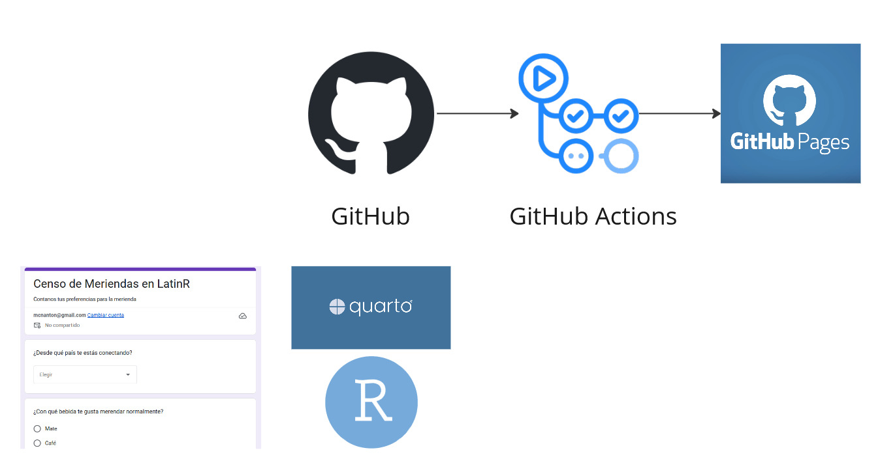{fig-align="center"}


# CI/CD y GitHub Actions

**Conceptos básicos**

## GitHub y GitHub Actions

::::: columns
::: {.column width="50%"}
{fig-align="center" width="488"}

**GitHub**

Plataforma orientada al desarrollo de software que integra repositorios
con control de versiones con un enfoque de desarrollo colaborativo
:::

::: {.column width="50%"}
{fig-align="center"}

**GitHub Actions**

Herramienta de integración y deploy continuo (CI/CD) que permite
automatizar el trabajo con código, desde los testeos hasta la
publicación de productos
:::
:::::

## ¿CI/CD?

> La integración continua (CI) consiste en integrar los cambios del
> código en un repositorio de código fuente compartido de forma
> automática y frecuente.La implementación o distribución continua (CD)
> es un proceso de dos partes que implica la integración, la prueba y la
> distribución de los cambios en el código.

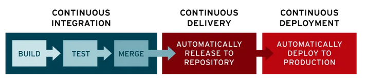{fig-align="center"}

*Fuente: Red Hat*

## Ejemplos no tan *lejanos*

**rOpenSci** usa CI/CD con GHA para actualizar su Guía de desarrollo!

::::: columns
::: {.column width="50%"}
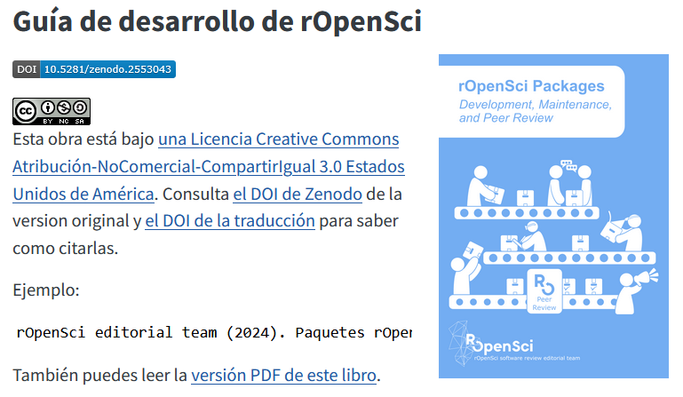{fig-align="center" width="488"}
{fig-align="center"}
:::

::: {.column width="50%"}
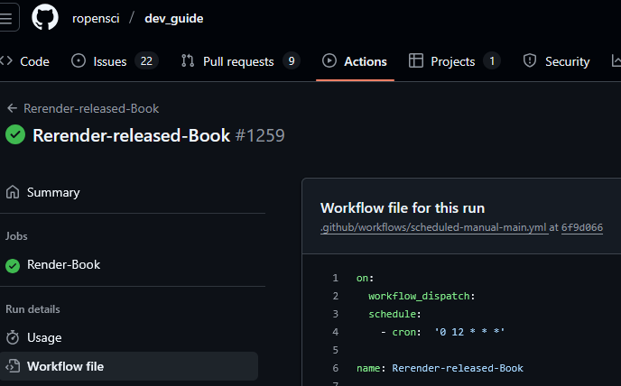{fig-align="center"}

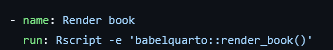{fig-align="center"}
:::
:::::

## Ejemplos no tan *lejanos*

**Turing Way** usa CI/CD con GHA para flujos de chequeo y publicación:
por ejemplo, para revisar el mal uso del latin en sus publicaciones!

::::: columns
::: {.column width="50%"}
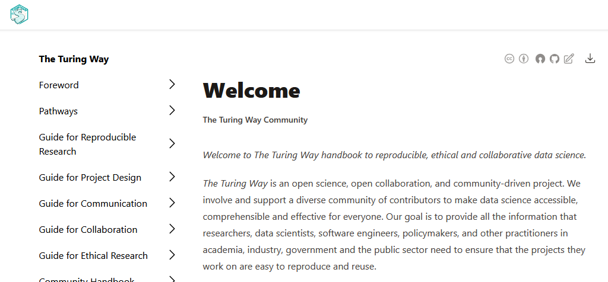{fig-align="center" width="488"}
{fig-align="center"}
:::

::: {.column width="50%"}
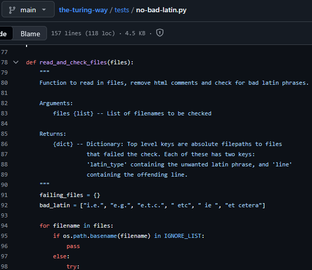{fig-align="center" width="347"}

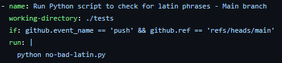{fig-align="center"}
:::
:::::

## ¿Notaron el uso de YAML?

Las GHA usan sintaxis YAML para organizar las automatizaciones. 

:::::: columns
::: {.column width="40%"}
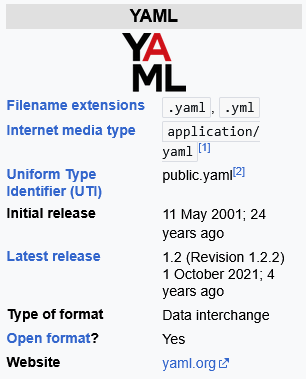{fig-align="center"}
:::

:::: {.column width="60%"}
::: {style="display:flex; justify-content:center; gap:20px; align-items:center;"}

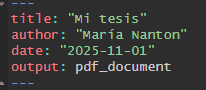
:::

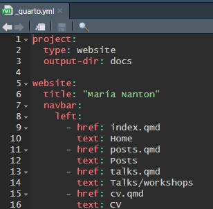{fig-align="center" width="265"}
::::
::::::

## ¿Qué vamos a incluir en este YAML?

¡Todo lo que un proyecto de Quarto con R necesita para ejecutarse de
manera automática!

::: incremental
-   Quarto, por supuesto
-   R para procesar nuestros datos
-   Un repositorio donde este alojado nuestro archivo Qmd
:::

## ¿Qué vamos a incluir en este YAML?

¡Todo lo que un proyecto de Quarto con R necesita para ejecutarse de
manera automática!

-   Quarto, por supuesto
-   R para procesar nuestros datos
-   Un repositorio donde este alojado nuestro archivo Qmd

Y además:

::: incremental
-   Instrucciones sobre cuándo correr las automatizaciones...
-   ... y una máquina virtual que las ejecute...
-   ... que pueda acceder a las dependencias necesarias e instalarlas!
:::

## De nuestra PC a GHA

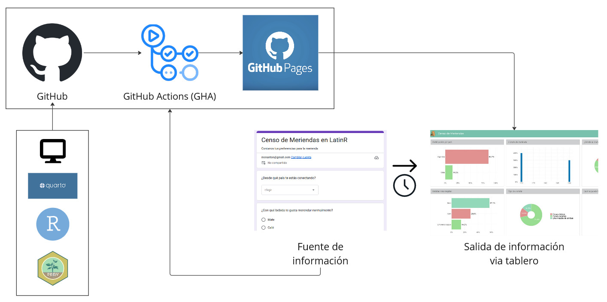{fig-align="center"}

## Instalación de dependencias

### Biblioteca `renv`

::::: columns
::: {.column width="50%"}
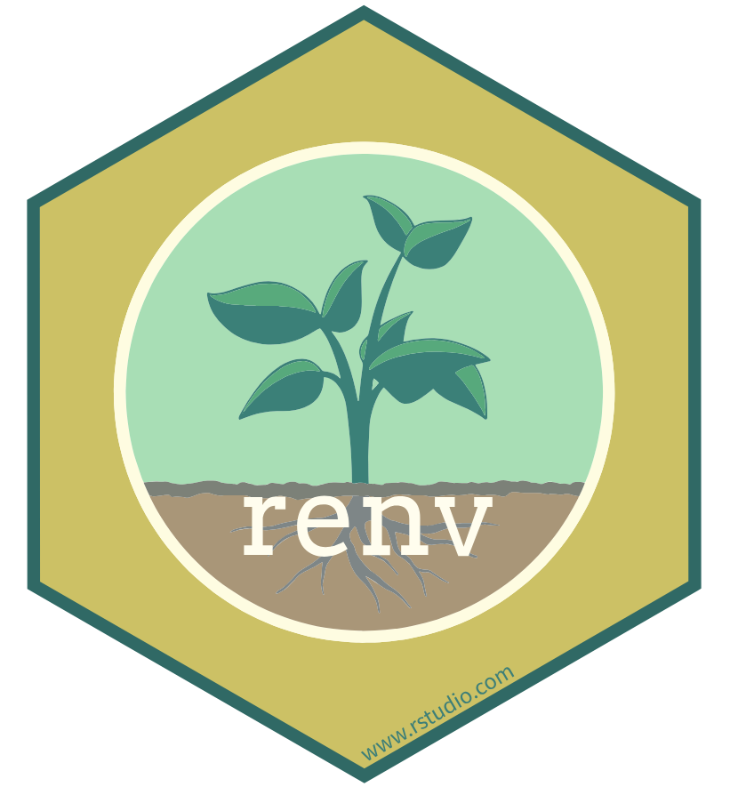{fig-align="center"}
:::

::: {.column width="50%"}
Herramienta que permite **capturar** todas las bibliotecas que usadas en
un proyecto e **instalarlas** si es necesario

Símil `venv` si vienen de manejar Python
:::
:::::

## ¿Dónde *corre* todo esto en una ejecución automatizada?

::::: columns
::: {.column width="50%"}
Una máquina virtual (VM) es una manera de emular un equipo físico (como
nuestras computadoras) en todos sus aspectos: espacio de almacenamiento,
memoria y **sistema operativo**.

Son entornos aislados que podemos utilizar para ejecutar procesos.
:::

::: {.column width="50%"}
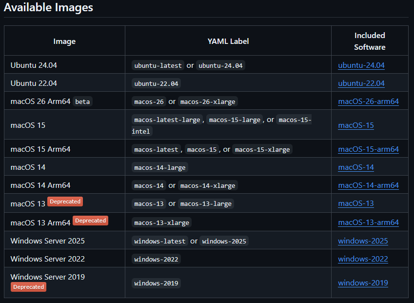{fig-align="center"}
:::
:::::

## Dándole ritmo a la automatización

### Programación de tareas con crontab

En sistemas operativos Unix, **cron** es un administrador de procesos
para ejecutarlos a intervalos regulares

### Expresiones CRON

```         
* * * * *   comando-a-ejecutar
| | | | |
| | | | └── Día de la semana (0-7, donde 0 y 7 representan domingo)
| | | └──── Mes (1-12)
| | └────── Día del mes (1-31)
| └──────── Hora (0-23)
└────────── Minuto (0-59)
```

## CRON

Con estas expresiones podemos ordenar la ejecución de procesos con
cualquier periodicidad

```         
0 * * * *   revisar_cada_una_hora
| | | | |
| | | | └── Día de la semana (todos)
| | | └──── Mes (todos)
| | └────── Día del mes (todos)
| └──────── Hora (todos)
└────────── Minuto (al minuto 0, es decir, el inicio de cada hora)
```

## Del código al HTML

::::: columns
::: {.column width="50%"}
{fig-align="center" width="173"}

**Quarto**

Herramienta para generar artículos, sitios o publicaciones en formatos
word, pdf, html, entre otros
:::

::: {.column width="50%"}
{fig-align="center" width="200"}

**Github Pages**

Herramienta de GitHub para crear sitios web directamente desde el
contenido de un repositorio
:::
:::::

## Ahora sí: la infraestructura de nuestra automatización

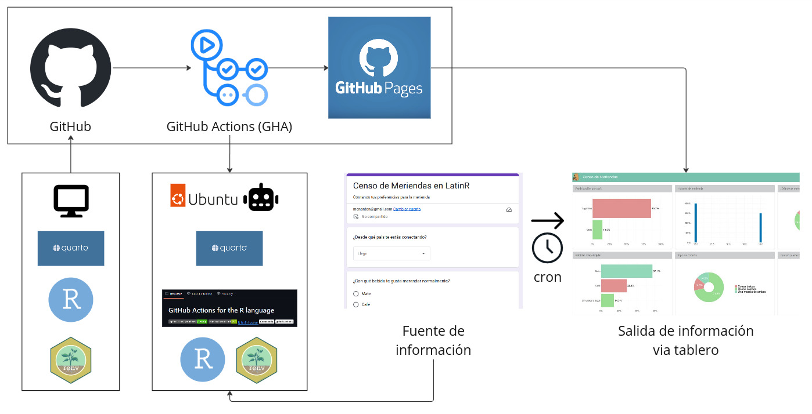{fig-align="center"}

# Mini-evaluación 1

Vamos a usar las reacciones de zoom para preguntas de opción múltiple

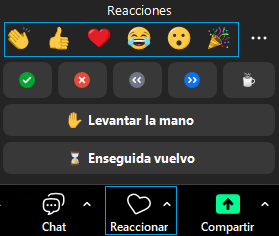{fig-align="center" width="179"}

## Mini-evaluación 1:

### ¿Qué herramiena permite controlar los paquetes necesarios para reproducir el proyecto en GitHub Actions?

👍 Quarto

😮 renv

👏 GitHub


## Mini-evaluación 1:

### ¿Qué formato utilizan los archivos de configuración de las GitHub Actions?

👍 YAML

😮 .workflow

👏 cron

## Mini-evaluación 1:

### ¿Cuál es el sistema operativo de la máquina que ejecutará las Github Actions?

👍 El de la computadora en la que se redactó el código

😮 El que elija GitHub para mi acción

👏 El de la máquina virtual que configure yo

# Break (5 minutos)

# Preparando nuestro entorno

**Recorrido por los elementos del proyecto en el repositorio**


# Break (5 minutos)


## Pasos previos a generar la GitHub Action

::: incremental
-   Creamos el form y la hoja de cálculo con acceso a cualquiera vía
    link
-   Creamos un proyecto de Quarto (website)
    -   inicializamos git
    -   inicializamos renv
-   Creamos el repositorio remoto en GitHub
-   Armamos el reporte o dashboard en el archivo **index.qmd**
    -   renv::snapshot()
-   Conectamos el repositorio local y el remoto desde la terminal de R
-   Actualizamos los cambios (commit y push)
:::

# Workflow de Github Actions

**Combinamos los elementos para un flujo automatizado**

## 

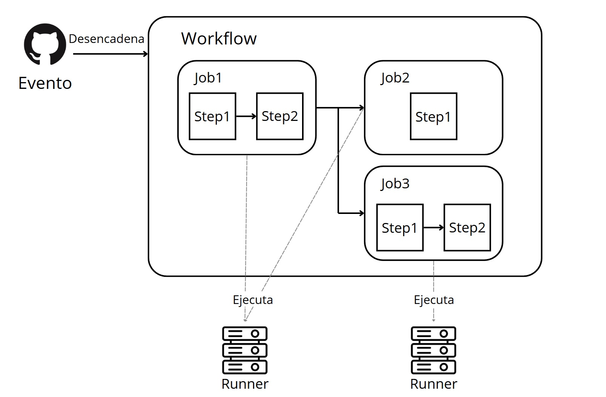

## 

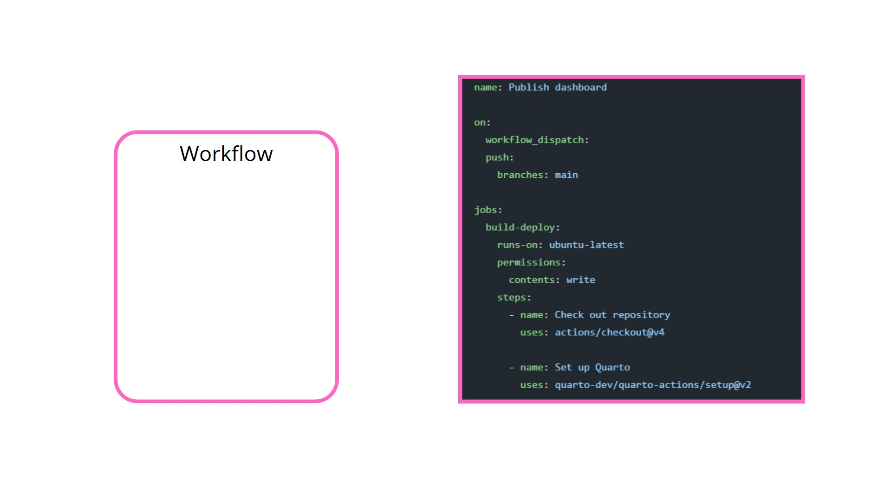

## 

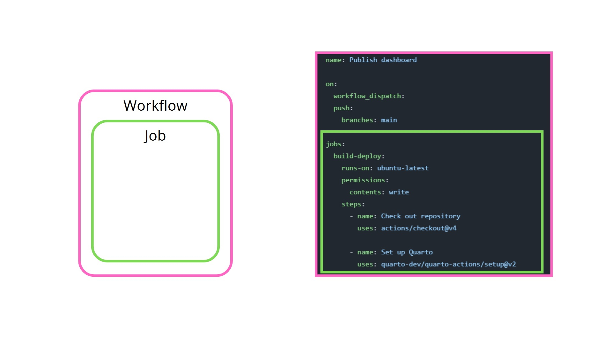

## 

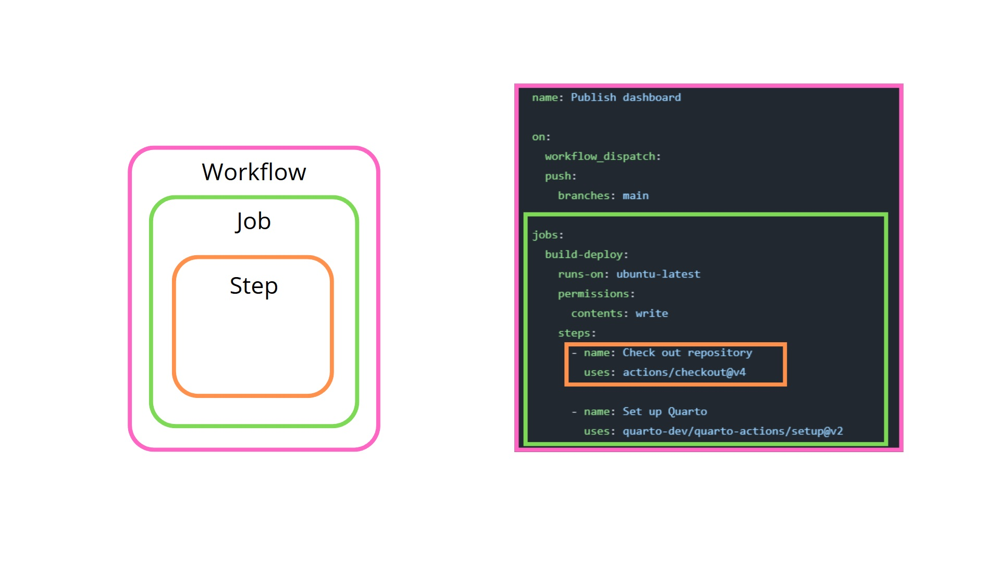

## 

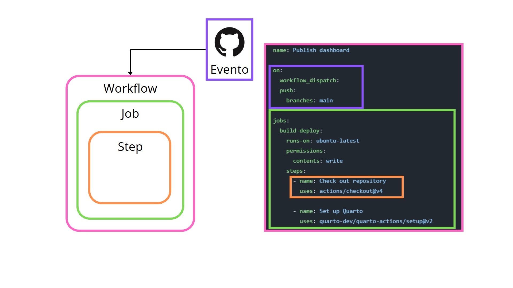

## 

:::::: {.columns style="display: flex !important; align-items: center; height: 90%;"}
::: {.column width="40%"}
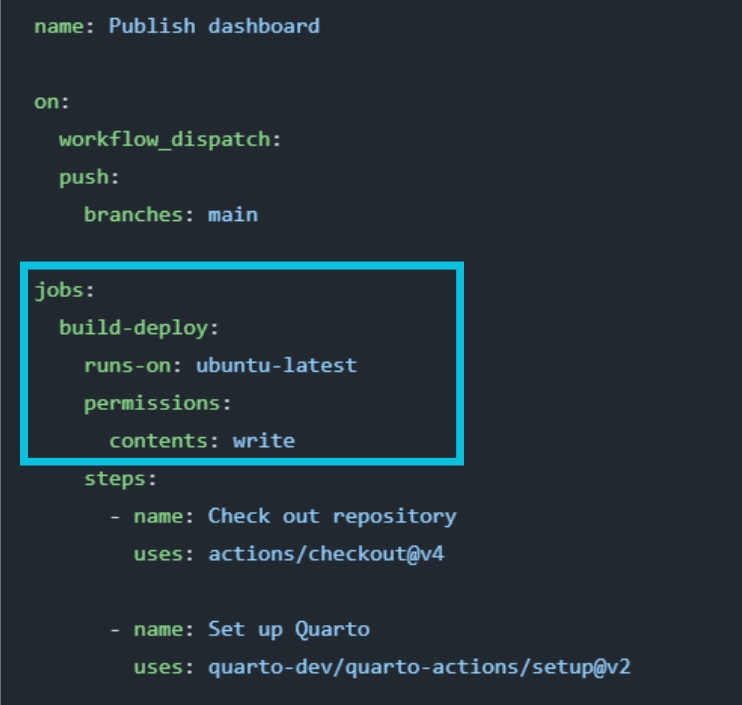
:::

:::: {.column width="50%" style="font-size: 0.8em;"}
::: {style="display: flex; flex-direction: column; justify-content: center; height: 100%; font-size: 0.9em;"}
-   **build-deploy** es el identificador del **job**
-   **runs-on** indica el tipo de máquina (runner) donde se ejecutará el
    **job**
:::
::::
::::::

## 

::::: {.columns style="display: flex !important; align-items: center; height: 90%;"}
::: {.column width="40%"}

:::

::: {.column width="50%" style="font-size: 0.8em;"}
-   **permissions** configura qué puede hacer el **job** sobre el
    contenido del repositorio:
    -   **write:** permiso de escritura (crear archivos, releases,
        actualizar archivos)
    -   **read:** permiso de lectura (no puede modificar el repositorio)
    -   Se puede especificar de forma global o a nivel de cada **job**
:::
:::::

## Tipos de steps (pasos)

::::: columns
::: {.column width="60%"}
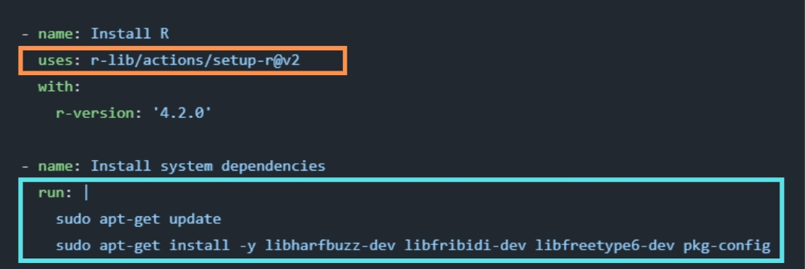
:::

::: {.column width="30%"}
**uses** utiliza una acción ya existente, empaquetada por GitHub o la
comunidad
:::
:::::

## Tipos de steps (pasos)

::::: columns
::: {.column width="60%"}

:::

::: {.column width="30%"}
**run** ejecuta comandos directamente en la terminal del runner
:::
:::::

## Tipos de steps (pasos)

::::: columns
::: {.column width="60%"}

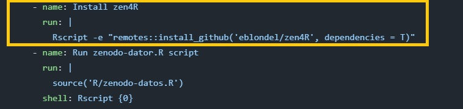

:::

::: {.column width="40%"}

-   Se puede ejecutar código en la terminal (shell) de la maquina
    virtual (para ubuntu, es bash)
    
:::
:::::

## Tipos de steps (pasos)

::::: columns
::: {.column width="60%"}

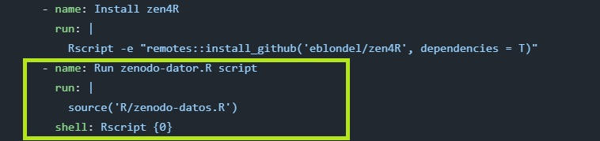

:::

::: {.column width="40%"}

-   Se puede ejecutar código indicando una terminal particular, en este
    caso la de R.

:::
:::::

## Tipos de steps (pasos)

Este paso usa una acción pre empaquetada para publicar un proyecto de
Quarto.

::::: columns
::: {.column width="40%"}
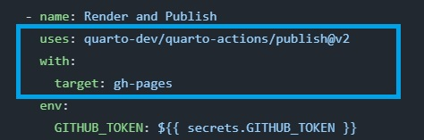
:::

::: {.column width="50%"}
**with:**

-   Los argumentos que la acción necesita para funcionar.
-   **target:** gh-pages/netlify/connect
:::
:::::

## Tipos de steps (pasos)

Este paso usa una acción pre empaquetada para publicar un proyecto de
Quarto.

::::: columns
::: {.column width="40%"}
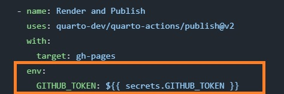
:::

::: {.column width="50%"}
**env:**

-   Variables de entorno.
-   GITHUB_TOKEN
:::
:::::

## GITHUB_TOKEN

**Token de autorización** que GitHub genera automáticamente para cada
ejecución de un workflow de GitHub Actions.

::::: columns
::: {.column width="40%"}

:::

::: {.column width="60%"}
-   Identifica al workflow y le permite interactuar con GitHub
-   Solo existe mientras dura la ejecución
-   Tiene permisos controlables
:::
:::::

## Secretos del repositorio

::::: columns
::: {.column width="50%"}

:::

::: {.column width="50%\""}
-   **secrets** hace referencia a un espacio seguro donde GitHub guarda
    valores sensibles (claves, tokens, constraseñas) encriptados.
:::
:::::

## Secretos del repositorio

::::: columns
::: {.column width="50%"}

:::

::: {.column width="50%\""}
-   **GITHUB_TOKEN** es el nombre de uno de esos valores.
:::
:::::

## Tipos de eventos que disparan un workflow (Triggers)


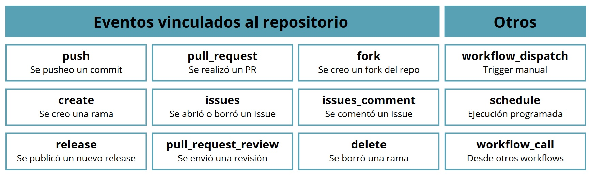


# Actualización automática y publicación en GitHub Pages

**Trabajamos en el repositorio**

## Repaso de la práctica

::: incremental
-   Creamos un fork del repositorio censo-meriendas
-   Creamos el archivo .github/workflows/\_publish.yml
-   Creamos la rama "gh-pages" y revisamos el setup en settings/pages
-   Modificamos los triggers para:
    -   Actualizar tras cada push
    -   Actualizar periódicamente
-   Revisamos el log de un workflow
:::

# Mini-evaluación 2

## Mini-evaluación 2:

### En qué parte del YAML se indica cuáles serán los disparadores del workflow?

👍 jobs:

😮 steps:

👏 on:

## Mini-evaluación 2:

### ¿De qué manera se puede ejecutar código de R dentro de una GHA?


👍 Dentro de un R script (ejemplo.R) via terminal de la VM

😮 Dentro de un R script (ejemplo.R) via terminal de R

🎉 Como un comando R aislado via `Rscript -e` (install.packages())

👏 Todas las opciones son correctas


## Temas cubiertos en el taller

# Buenas prácticas

## Buenas prácticas

::: incremental
-   Separar el “build”, las pruebas (“test”) y el “deploy” en jobs
    independientes.
-   Paralelizar jobs cuando sea posible.
-   Reutilizar acciones de terceros (third-party actions)
-   Instalar versiones específicas de las herramientas
-   Aplicar el principio de menor privilegio.
-   **Gestionar claves de API y contraseñas como variables de entorno
    usando GitHub Secrets.**
:::

## Secretos del repositorio

::::: columns
::: {.column width="50%"}
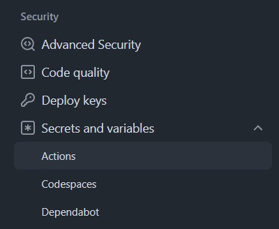
:::

::: {.column width="50%\""}
-   Permiten acceder a credenciales o información sensible sin
    escribirlo directamente en el código.

-   Todo lo que almacenamos aquí queda cifrado y nunca se muestra en
    texto plano.
:::
:::::

## Secretos del repositorio

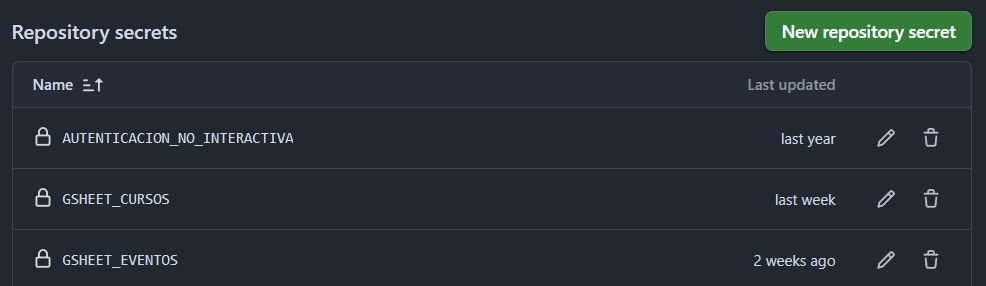

-   Cada secreto tiene un **nombre** y un **valor oculto**.

-   Usamos el nombre para invocar el valor desde GitHub Actions.

## Secretos del repositorio

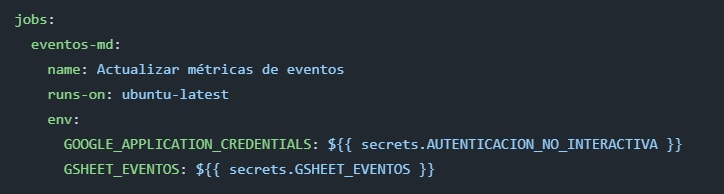

Con **env** creamos variables de entorno dentro del **job**, cuyo valor
proviene de los secretos del repositorio.

## Secretos del repositorio

::::: columns
::: {.column width="60%"}
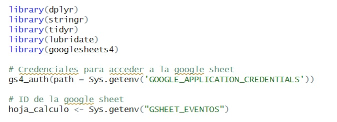
:::

::: {.column width="40%\""}
En **R**, las variables de entorno se leen con **Sys.getenv()**.
:::
:::::

# **¡Muchas gracias por compartir este taller con nosotras!**

Por favor, dejanos una pequeña reseña aquí 👉
[**http://tiny.cc/quarto-GHA**](http://tiny.cc/quarto-GHA)

# Preguntas?

Contactanos! **jesica.formoso\@gmail.com**\| **mcnanton\@gmail.com**
